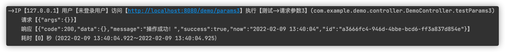

# plus-spring-boot-starter

#### 介绍

springboot增强工具 ———— 旨在减少项目中的反复配置和重复性简单劳动，提升开发效率，从重复和简单的劳动中解放出来的工具集合。

包含： 日志、swagger文档、跨域、异常处理、常用工具类等。

#### 安装教程

* SpringBoot版本要求>=2.4.0
* 最新版本：[](https://search.maven.org/search?q=g:%22cn.fanzy.plus%22%20AND%20a:%22plus-spring-boot-starter%22)

```xml

<dependency>
    <groupId>cn.fanzy.plus</groupId>
    <artifactId>plus-spring-boot-starter</artifactId>
    <version>1.0.0</version>
</dependency>
```

#### 使用说明

1. 日志组件

* 配置文件,默认为开启

```properties
plus.aop.log.enable=true
```

* 日志输出样式
  
* 重写日志输出

> 可用于更改日志输出格式或写入到数据库

1. 实现LogCallbackService接口，并交由Spring管理即可。

```java

@Slf4j
@Service
public class LogCallbackServiceImpl implements LogCallbackService {
    /**
     * 回调
     * 日志执行回调函数
     * <pre>实现此方法，可拿到日志调用参数，并进一步加工处理。</pre>
     *
     * @param ip           IP地址
     * @param user         当前用户
     * @param url          请求url
     * @param method       请求方法名
     * @param swaggerName  Swagger的名称
     * @param requestData  请求数据
     * @param responseData 响应数据
     * @param start        开始时间
     * @param end          结束时间
     * @param second       执行秒数
     */
    @Override
    public void callback(String ip, String user, String url, String method, String swaggerName, String requestData, String responseData, Date start, Date end, long second) {
        // 默认日志打印
        LogOutUtil.out(ip, user, url, method, swaggerName, requestData, responseData, start, end, second);
        // todo 写入到数据库
    }
}
```

* 实现LogUserService接口，在日志打印中添加登录人相关信息 。

```java

@Service
public class LogUserServiceImpl implements LogUserService {
    @Override
    public String getCurrentUser() {
        // todo 查询当前登录ID
        return "Test";
    }
}

```

2. swagger文档

> 系统集成了[knife4j 2.0.9](https://gitee.com/xiaoym/knife4j)，一些个性化配置，见https://doc.xiaominfo.com/knife4j/documentation/

* 访问地址：/doc.html。
    * http://localhost:PORT/doc.html
* 配置文件：`plus.swagger`开头

```properties
# 启用swagger文档，默认为开启。
plus.swagger.enable=true
# 访问文档需要Http Basic认证
plus.swagger.knife4j.basic.enable=true
plus.swagger.knife4j.basic.username=admin
plus.swagger.knife4j.basic.password=123456
```

3. 全局跨域 —— 默认开启

```properties
plus.cors.enable=true
# 跨域设置是否允许携带凭据，默认为true
plus.cors.allow-credentials=true
# 跨域设置允许的请求头，默认为所有
plus.cors.allowed-headers=*
# 跨域设置允许的请求方法，默认为所有
plus.cors.allowed-methods=*
# 跨域设置允许的Origins，默认为所有
plus.cors.allowed-origins=*
# 跨域设置允许的路径，默认为所有路径
plus.cors.url=/**
```

4. jackson的null处理 —— 默认开启

```properties
plus.json.enable=true
```

5. 全局异常处理 —— 默认开启

```properties

plus.error.enable=true
```

6. 工具类

* 注解`@PathRestController("/demo")`整合注解，少写点代码。
* `BaseArgs` 用于分页查询参数。默认从query或posted form data中获取pageNum，pageSize
* `Json` 全局返回工具类，内容多种方法。code==200表示成功。
* `SpringUtils`继承自[Hutool](https://gitee.com/dromara/hutool)的`SpringUtil`，添加直接获取request、response和客户端IP方法。
* `HttpUtil`实现输出Json、Web、重定向、下载、控制台输出等方法。

7. [Sa-Token](https://gitee.com/dromara/sa-token)异常捕获支持。只需引入SaToken相关依赖即可。
8. 更改了Springboot以下默认配置
```properties
spring.mvc.throw-exception-if-no-handler-found=true
spring.web.resources.add-mappings=false
spring.output.ansi.enabled=always
spring.mvc.format.date=yyyy-MM-dd
spring.mvc.format.date-time=yyyy-MM-dd HH:mm:ss
spring.mvc.format.time=HH:mm:ss
```
#### 参与贡献

1. Fork 本仓库
2. 新建 Feat_xxx 分支
3. 提交代码
4. 新建 Pull Request

#### 特技

1. 使用 Readme\_XXX.md 来支持不同的语言，例如 Readme\_en.md, Readme\_zh.md
2. Gitee 官方博客 [blog.gitee.com](https://blog.gitee.com)
3. 你可以 [https://gitee.com/explore](https://gitee.com/explore) 这个地址来了解 Gitee 上的优秀开源项目
4. [GVP](https://gitee.com/gvp) 全称是 Gitee 最有价值开源项目，是综合评定出的优秀开源项目
5. Gitee 官方提供的使用手册 [https://gitee.com/help](https://gitee.com/help)
6. Gitee 封面人物是一档用来展示 Gitee 会员风采的栏目 [https://gitee.com/gitee-stars/](https://gitee.com/gitee-stars/)
